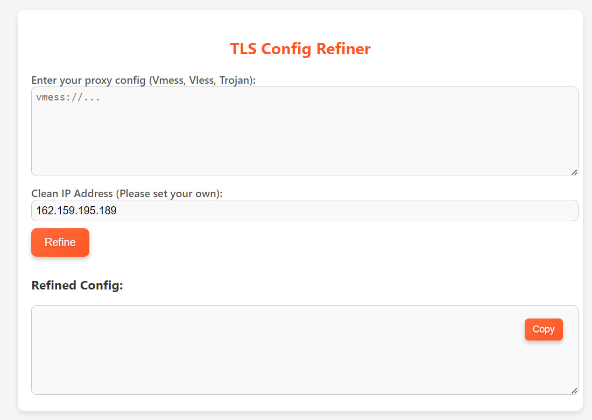
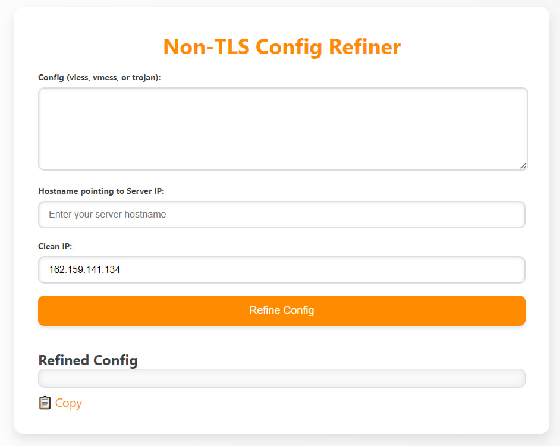

<h1 align="center">
  بازنویسی کانفیگ های V2ray
</h1>

<h2 align="center">
دسترسی به کانفیگ های v2ray سرور شخصی با استفاده از وب سوکت‌ها
  <h3>
    <a href="README.md">English 🇬🇧</a> | 🇮🇷 فارسی
  </h3> 
</h2>

## معرفی
🟢 زمانی که اتصال مستقیم به کانفیگ‌های v2ray در دسترس نیست، این روش جایگزین می‌تواند ترافیک را از طریق Cloudflare به سرور مقصد هدایت کند.

## پیش نیازها
1.  در سایت https://dash.cloudflare.com لاگین یا ثبت نام کنید و آدرس ایمیل خود را تأیید کنید.
2. به بخش Workers and Pages رفته و یک ورکر جدید ایجاد کنید.
3. برای ورود به محیط ویرایش ورکر، Edit Code رو بزنید.

## نسخه TLS (دامنه ثبت شده در کلاودفلیر با پروکسی روشن)

  

🟡 این روش فقط در صورتی کار می کند که پنل v2ray شما دارای یک دامنه ثبت شده در Cloudflare با گواهی TLS باشد و وضعیت پروکسی Cloudflare روی ON باشد.

🟡 در پنل v2ray خود، یک کانفیگ با مشخصات زیر بسازید:
* نوع: Vmess, Vless or Trojan
* ترنسپورت (شبکه): Websocket (WS)
* امنیت: TLS
* هاست: دامنه ای که روی کلاودفلیر ثبت کردید (گواهی TLS داشته و پروکسی کلاودفلیر روشن باشد)
* پورت: 443

🟡 آخرین نسخه [اسکریپت بازنویسی کانفیگ TLS](https://github.com/Surfboardv2ray/v2ray-refiner/releases/latest/download/_worker.js) رو دریافت کنید، کل محتوا را در ورکر خود کپی و جایگذاری/آپلود کنید و روی deploy کلیک کنید.

🟡 لینک ورکر رو باز کنید، کانفیگ و آیپی تمیز کلاودفلیر خودتون رو وارد کنید و `Refine` رو بزنید تا بازنویسی انجام بشه.

## نسخه بدون TLS (دامنه در کلاودفلیر ثبت نشده، یا دامنه بدون سرتیفیکیت

  

🟠 در صورتی از این روش استفاده کنید که دامنه ندارید یا دامنه شما در کلاودفلیر ثبت نشده، یا گواهی TLS برای آن نگرفته اید.

🟠 یک Hostname از نوع A در سایت‌های رایگانی مثل https://noip.com بسازید و IPv4 سرور خود را به آن وصل کنید.

🟠 در پنل v2ray خود، یک کانفیگ با مشخصات زیر بسازید:
* نوع: Vmess, Vless or Trojan
* ترنسپورت (شبکه): Websocket (WS)
* امنیت: None (خاموش)
* هاست: دامنه یا ساب دامنه رایگانی که ساختید
* پورت: 80

🟠 آخرین نسخه [اسکریپت بازنویسی کانفیگ Non-TLS](https://github.com/Surfboardv2ray/v2ray-refiner/releases/latest/download/worker.js) رو دریافت کنید، کل محتوا را در ورکر خود کپی و جایگذاری/آپلود کنید و روی deploy کلیک کنید.

🟠 لینک ورکر رو باز کنید، کانفیگ، آیپی تمیز کلاودفلیر، و دامنه رایگانی که ساختید رو وارد کنید و `Refine Config` رو بزنید تا بازنویسی انجام بشه.

## ویرایش اسکریپت Non-TLS
🟢 پورت پیش فرض کانفیگ ها در این نسخه 80 است `url.port = 80` اگر کانفیگ شما از پورت دیگری استفاده میکند در این بخش میتونید تغییر بدید.

## سایر نکات
🟢 اگر دامنه شما از دسترس خارج (فیلتر) شده باشه هم از این روش میتونید استفاده کنید.
🟢 آیپی های تمیز رو از [مخزن IRCF](https://github.com/ircfspace/cf2dns/blob/master/list/ipv4.json) میتونید دریافت کنید، اما توصیه میشه از [اسکنرها](https://ircf.space/scanner.html) استفاده کنید.

## تقدیر و تشکر
* ایده بازنویسی کانفیگ‌ها و بخش پایه کد بازنویسی TLS با تشکر از مهندس وحید فرید [v2ray-worker-merge](https://github.com/vfarid/v2ray-worker-merge/tree/main).
* ایده و کد بازنویسی کانفیگ های Non-TLS تشکر از وبلاگ فرینود [GetAFreeNode](https://getafreenode.com/blog/index.php/tutorial/31.html).
