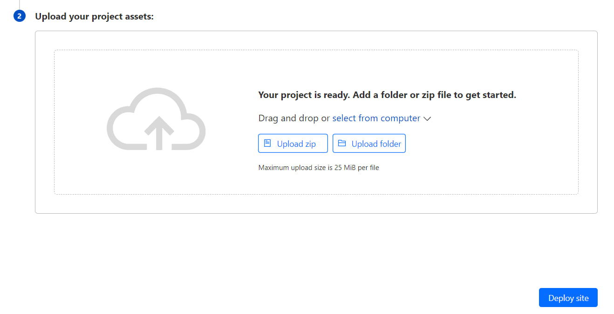

<h1 align="center">
  بازنویسی کانفیگ های V2ray
</h1>

## پیاده سازی بر روی پیجز کلودفلر

🟡 از بخش Workers and Pages، وارد Pages بشید. در قسمت Create using direct upload روی Upload Assets بزنید. یک اسم برای پروژه انتخاب کنید و Create Project رو بزنید.
 
🟡 آخرین نسخه [بازنویسی TLS رو از اینجا](https://github.com/Surfboardv2ray/v2ray-refiner/releases/latest/download/tls_PAGES.zip), یا [بازنویسی Non-TLS رو از اینجا](https://github.com/Surfboardv2ray/v2ray-refiner/releases/latest/download/nontls_PAGES.zip) دانلود کنید. سپس فایل زیپ رو در قسمت Upload your project assets، درگ و دراپ کنید یا بر روی select from computer و سپس upload zip کلیک کنید و فایل زیپ مورد نظر رو انتخاب کنید. پس از آپلود، نسخه دیپلوی شده رو میتونید مشاهده کنید.

  

